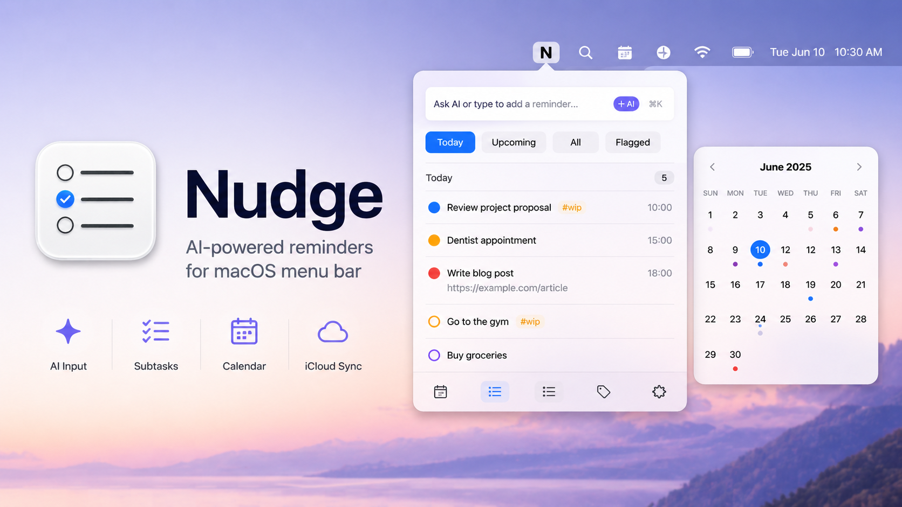

<div align="center">



# Hutch

**A tiny shelf for reminders, parked in your menu bar.**

[🇯🇵 日本語](README.md) · 🇺🇸 English

[](https://github.com/Riku4230/Hutch/releases/latest)
[](LICENSE)
[](https://github.com/Riku4230/Hutch/releases/latest)
[](https://swift.org)
[](https://github.com/Riku4230/Hutch/stargazers)

[**Install**](#-install) ·
[**Features**](#-features) ·
[**Usage**](#-usage) ·
[**Architecture**](#-architecture)

</div>

---

Hutch reads and writes the **native** Apple Reminders database directly through EventKit, so anything you add syncs through iCloud to your iPhone, iPad, and other Macs in real time. Uninstalling Hutch leaves all your data intact — it lives inside the system Reminders app.

On top of that foundation, Hutch adds **AI input**, **subtask hierarchies**, **three-state status**, and a **calendar overview** — the things that are missing when you want to "open, jot, and close" on your Mac.

## ⚡ Quick start

```bash
brew tap Riku4230/hutch https://github.com/Riku4230/Hutch.git
brew install --cask hutch
```

> One line. No Homebrew? Grab the `.dmg` from [Releases](https://github.com/Riku4230/Hutch/releases/latest).

## ✨ Features

| | |
|---|---|
| 🪶 **Lives in the menu bar** | No Dock icon. Open with double-tap `Fn` or any global hotkey. |
| 🤖 **Natural-language input** | Type "Dentist tomorrow at 3 PM https://..." and Hutch extracts the date, notes, and URL. |
| 🎯 **Three-state checkbox** | Not started / in-progress / done. The in-progress state syncs to iCloud as a `#wip` tag. |
| 🌳 **Subtask hierarchy** | Writes via Shortcuts.app and reads from the SQLite store, matching the native app's parent-child layout. |
| 🪄 **AI subtask breakdown** | Have AI split a parent task into 3-7 actionable subtasks, edit them, and add them in one shot. |
| 📅 **Calendar view** | Month grid with dots colored by list. Japanese national holidays included. |
| 🔔 **Animated status icon** | The menu-bar icon pulses when an alarm fires. No permanent count badge. |
| 🔌 **Multi-provider AI** | Claude Code (CLI), Anthropic, OpenAI, or Gemini. API keys live in Keychain. |
| 🌗 **Light / Dark / System** | Glass Float design that switches instantly. |
| ☁️ **iCloud-shared lists** | Lists you created in the native Reminders app work as-is. |

## 🚀 Install

### Homebrew (recommended)

```bash
brew tap Riku4230/hutch https://github.com/Riku4230/Hutch.git
brew install --cask hutch
```

### `.dmg` direct download

Grab `Hutch-*.dmg` from [the latest release](https://github.com/Riku4230/Hutch/releases/latest), open it, and drag `Hutch.app` into `Applications`.

> If Gatekeeper warns you on first launch, head to **System Settings → Privacy & Security → "Open Anyway"**.

### From source

```bash
git clone https://github.com/Riku4230/Hutch.git
cd Hutch
./scripts/build_app.sh --install
```

Requires macOS 14+, Swift 5.9+, and Xcode command-line tools.

## 🧭 First launch

The in-app onboarding wizard walks you through four steps:

1. **Reminders full access** — accept the system prompt
2. **Subtask Shortcut import** — Hutch installs a small shortcut into Shortcuts.app
3. **Full Disk Access** — required only for the hierarchical subtask view (optional)
4. **AI provider setup** — required only for natural-language input and AI subtask breakdown (optional)

Each step is skippable. You can revisit them anytime from the "⋯" menu.

## 🤖 AI mode

Switch the input bar to `AI` mode and type freely.

| Input | Result |
|---|---|
| `Dentist tomorrow at 3pm` | "Dentist", tomorrow at 15:00 |
| `Finish report by Friday` | "Finish report", this Friday |
| `Read https://example.com/article` | "Read article" with URL attached |
| `Add laundry and cleanup to home list` | Two reminders in the "home" list |

### Providers

Open "⋯ → AI Settings" and pick one:

| Provider | What you need |
|---|---|
| **Claude Code (CLI)** | Just have the `claude` command on your `PATH`. |
| **Anthropic API** | An API key from [console.anthropic.com](https://console.anthropic.com/). |
| **OpenAI** | An API key from [platform.openai.com](https://platform.openai.com/). |
| **Google Gemini** | An API key from [aistudio.google.com](https://aistudio.google.com/). |

API keys are stored only in macOS Keychain (Generic Password). They never touch a plaintext file or a remote server.

### AI subtask breakdown

Expand a parent reminder and tap **`✨ Generate with AI`** → review the suggested 3–7 subtasks → edit, add, or remove them → confirm to add them all.

## 🌳 How subtasks work

EventKit doesn't expose a public API for subtask relationships, so Hutch uses two indirect paths:

- **Write**: a bundled Shortcuts.app shortcut (`AddSubReminder.shortcut`) is invoked through `/usr/bin/shortcuts run`
- **Read**: the native Reminders SQLite store at `~/Library/Group Containers/group.com.apple.reminders/...` is opened read-only and snapshot-copied to a temp directory before the parent map is extracted

See [Subtask setup](#-subtask-setup) for the manual steps.

## 🎯 Three-state status

Tap the checkbox to cycle through three states:

| State | Visual | Internals |
|:-:|:-:|---|
| Not started | ◯ | `isCompleted = false`, no `#wip` |
| In progress | spinner | `isCompleted = false`, `#wip` tag attached |
| Done | ✓ | `isCompleted = true` |

The `#wip` tag also appears on iPhone via iCloud and can be edited from the native Reminders app. Rename it via `progressTag` in `ReminderStore.swift`.

## 🌐 Subtask setup

The onboarding wizard handles this. To set it up later, manually:

### 1. Import the shortcut

```bash
open ~/Applications/Hutch.app/Contents/Resources/AddSubReminder.shortcut
```

In the Shortcuts.app dialog, click **"Add Shortcut"**. Don't rename it — it must stay as `ReminderMenu Add Subtask` for backward compatibility.

### 2. Hierarchy view requires Full Disk Access

```
System Settings → Privacy & Security → Full Disk Access → toggle on Hutch
```

Without this permission, subtasks still get added correctly — they just appear flat inside Hutch. The native Reminders app and iPhone display them hierarchically as expected.

### Limitations

- macOS Shortcuts' "Find Reminders" action has no ID filter, so the parent is matched by title + list
- If multiple incomplete reminders share the same title in the same list, Hutch refuses to add a subtask to avoid attaching to the wrong parent
- Only one nesting level is supported (matching the native Reminders UI)

## 🏗 Architecture

<details>
<summary>Diagram and key files</summary>

```
┌──────────────────────────────────────────────┐
│              Hutch.app                       │
│  ┌──────────────────────────────────────┐    │
│  │  SwiftUI View Layer                  │    │
│  │  MainView / ReminderRow / Calendar   │    │
│  └────────────┬─────────────────────────┘    │
│               │                              │
│  ┌────────────▼─────────────────────────┐    │
│  │  ReminderStore (ObservableObject)    │    │
│  └────┬──────────┬──────────┬───────────┘    │
│       │          │          │                │
│  ┌────▼───┐ ┌────▼─────┐ ┌──▼──────────┐     │
│  │EventKit│ │Shortcuts │ │ SQLite      │     │
│  │read/   │ │ CLI      │ │ read-only   │     │
│  │write   │ │(subtask) │ │(parent map) │     │
│  └────────┘ └──────────┘ └─────────────┘     │
│                                              │
│  ┌────────────────────────────────────┐      │
│  │  AIProvider (Claude/OpenAI/Gemini) │      │
│  └────────────────────────────────────┘      │
└──────────────────────────────────────────────┘
        │                │              │
        ▼                ▼              ▼
   iCloud Reminders  Shortcuts.app  ~/Library/.../Reminders
```

### Key files

| File | Purpose |
|---|---|
| `ReminderStore.swift` | EventKit reads/writes, in-progress status, subtask integration |
| `RemindersSQLite.swift` | Reads the parent map from the system DB (read-only) |
| `ShortcutsBridge.swift` | Swift wrapper around `shortcuts run` |
| `AIProvider.swift` + `Providers/*.swift` | LLM provider abstraction and concrete implementations |
| `NLParser.swift` | Natural language → `ReminderDraft` / subtask candidates |
| `Holidays.swift` | Rule-based Japanese national holiday calculation |
| `MainView.swift` | Top-level menu bar popover |
| `OnboardingView.swift` | First-launch wizard |

</details>

## 💡 Why "Hutch"?

Hutch is **a tiny shelf you keep within arm's reach while you work** — built for reminders.

The native Reminders app on macOS hides everything behind "Cmd+Tab → Reminders → type → close." Just enough friction that you put it off and forget. Like getting up from your desk to open a far cupboard.

A *hutch* is a small storage shelf in a kitchen or workshop — the kind you fill with daily-use items so they're visible and within reach. You don't bury them in a drawer.

That's the whole idea: park your reminders on a shelf in your menu bar. **Same data as the native app, just stored within reach.** No need to migrate to Things, OmniFocus, or any other separate database.

## 🛠 Development

```bash
# Debug build
swift build

# Release build + install into ~/Applications
./scripts/build_app.sh --install

# Restart
pkill -f Hutch.app && open ~/Applications/Hutch.app
```

No external dependencies (Swift Package Manager only; SQLite3 is provided by the system).

### Releasing

```bash
git tag v0.X.Y
git push origin v0.X.Y
```

GitHub Actions then automatically:
1. Builds on macOS 14
2. Packages the `.dmg` and computes its SHA256
3. Publishes a GitHub Release
4. Updates the Homebrew Cask version / sha256 on `main`

## 🤝 Contributing

PRs and issues welcome.

- Bug reports: [open an issue](https://github.com/Riku4230/Hutch/issues/new)
- Feature requests: [Discussions](https://github.com/Riku4230/Hutch/discussions) or an issue
- Security: see [SECURITY.md](SECURITY.md)

## 📄 License

MIT License — fork and modify freely. See [LICENSE](LICENSE).

## 🙏 Credits

- Natural language understanding: [Anthropic Claude](https://www.anthropic.com/) / [OpenAI](https://openai.com/) / [Google Gemini](https://ai.google.dev/)
- App icon: `Resources/AppIcon.icns`

---

<div align="center">

Made with ❤️ for the macOS Reminders ecosystem

</div>
